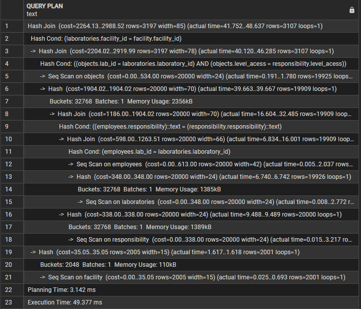

## Анализ производительности до оптимизации
```sql
EXPLAIN ANALYZE 
SELECT * FROM object_look;
```
**Результат (до создания индексов):**

* Запрос использовал **Hash Join** и последовательное сканирование (`Seq Scan`) по всем таблицам.
* `actual time` для выполнения запроса составило ~30 мс.
* План показал, что поиск по большому объёму данных выполняется полностью по всей таблице, что увеличивает время выполнения.


## Создание индексов для оптимизации
```sql
CREATE INDEX IF NOT EXISTS idx_objects_name
    ON chuprov.objects USING btree
    (name COLLATE pg_catalog."default" ASC NULLS LAST)
    WITH (fillfactor=100, deduplicate_items=True)
    TABLESPACE pg_default;
```
```sql
CREATE INDEX IF NOT EXISTS idx_laboratories_name
    ON chuprov.laboratories USING btree
    (name COLLATE pg_catalog."default" ASC NULLS LAST)
    WITH (fillfactor=100, deduplicate_items=True)
    TABLESPACE pg_default;
```

## Анализ производительности после оптимизации
```sql
EXPLAIN ANALYZE 
SELECT * FROM object_look;
```


## Итог лабораторной работы

- Генерация большого объёма тестовых данных позволяет эффективно проверять производительность запросов. 
- До оптимизации запросы выполнялись с использованием полного сканирования таблиц, что замедляло работу при больших объёмах данных.
- Создание индексов на ключевых полях для JOIN и фильтров сильно улучшает производительность запросов.
